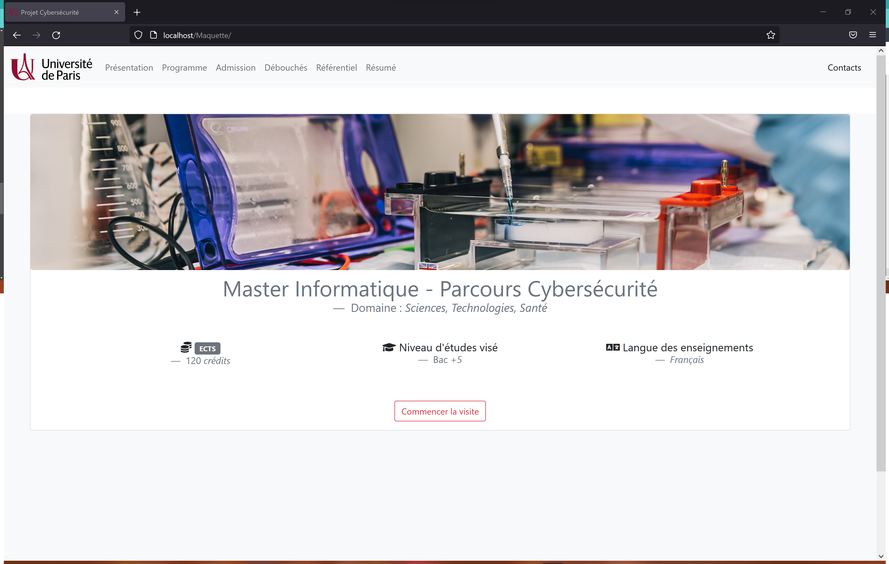
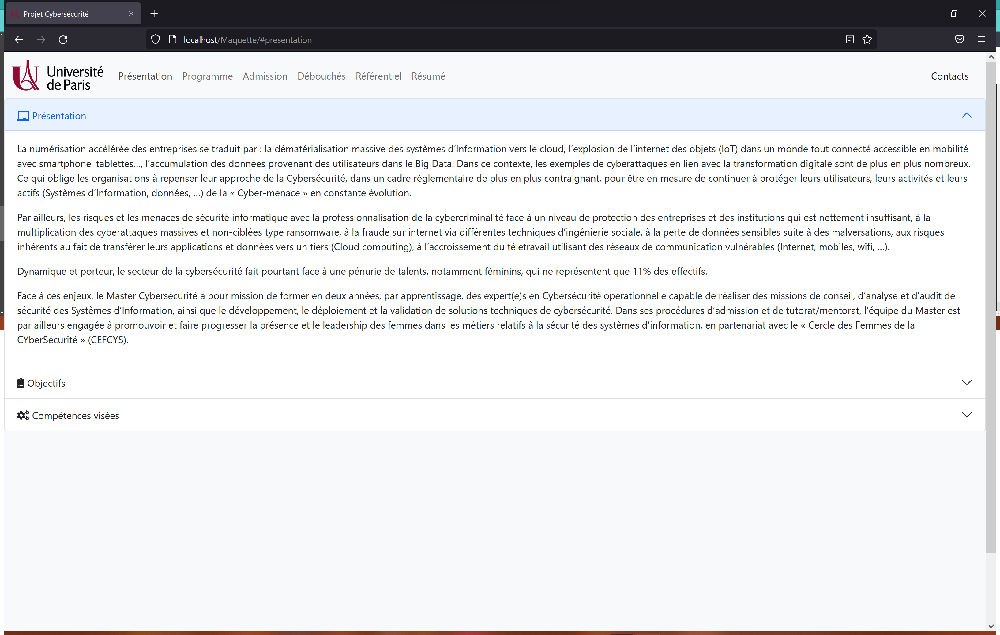
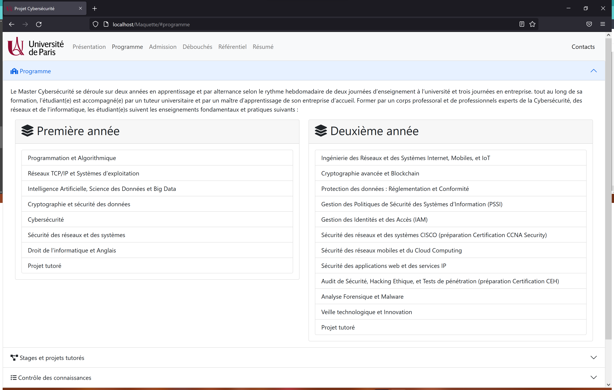
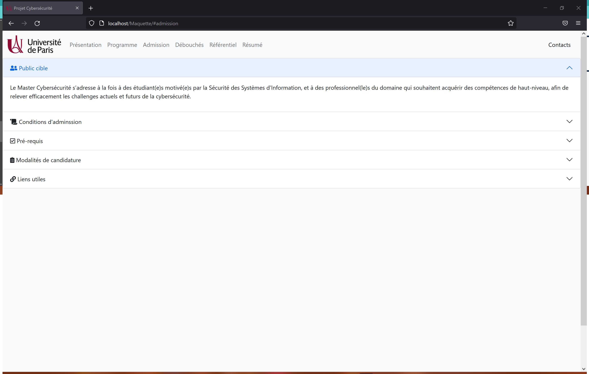
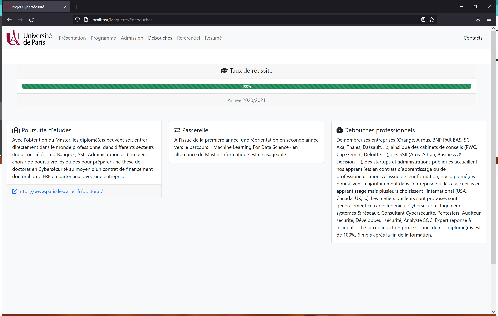
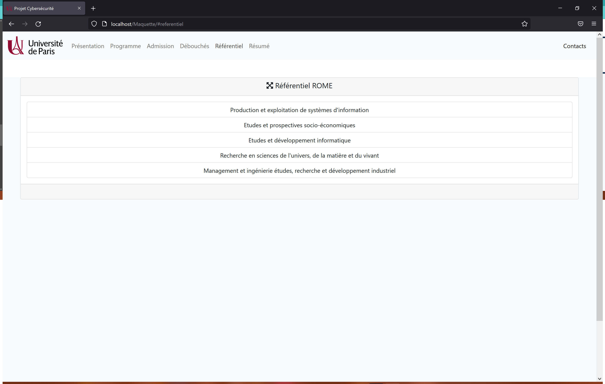
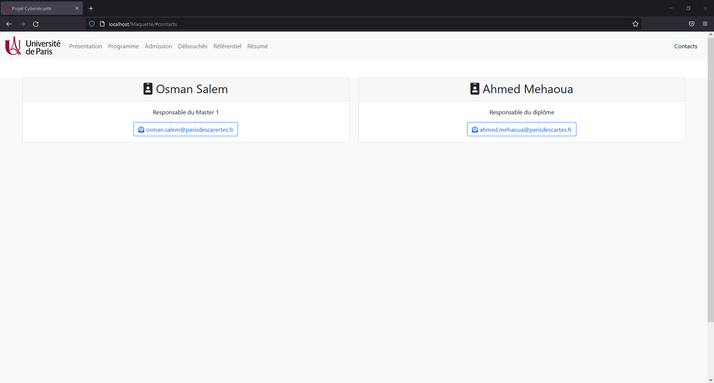

#[Site Web Projet](https://alexandre-o.github.io/Prog-dist/)

---

> Auteurs:   
>[**_PATEL Stéphane_**]()  
>[**_OGANEZOV Alexandre_**]()
>
> Temps de lecture: **_\~ 5 minutes_**
>
> Version: **_`1.0.0`_**

> `v1.0` `Bootstrap 5.1.3` `Font Awesome 5.15.4` `HTML 5` `JavaScript` `JQuery 3.6.0` `Mustache 3.0.3`  
> [Code source](https://github.com/alexandre-o/Prog-dist)  
> [URL](https://alexandre-o.github.io/Prog-dist/)

## Sommaire
- [Résumé](#Résumé)
- [Le site](#Le-site)
  ️
## Résumé
> Développement d'un site Web reprenant les informations du [Master en Cyber Sécurité de l'Unviersité de Paris DesCartes](https://odf.u-paris.fr/fr/offre-de-formation/master-XB/sciences-technologies-sante-STS/informatique-K2NDIF4R/master-informatique-parcours-cybersecurite-JT5NYCBV.html) dans le cadre d'un projet.

> Le site a été entièrement développé en HTML et JavaScript, en s'appuyant sur JQuery, sur le Framework Bootstrap pour la partie front-end du site, ainsi que de FontAwesome pour l'utilisation des différents icônes présents.

> L'index HTML contient la structure principale de la page affichée.
> Ce fichier contient l'en-tête HTML, la Barre de navigation qui fait office d'entête de page, le corps de la page (vide) ainsi que le pied de page.

Extrait du fichier `index.html`
```html
    ...
    <!-- Corps de la page -->
    <body class="h-100 w-100">
        <!-- division englobant l'ensemble des éléments au sein du body -->
        <div class="h-100 w-100">
                <!-- NavBar BootStrap: https://getbootstrap.com/docs/5.1/components/navbar/ -->
                <nav class="navbar navbar-expand-lg navbar-light bg-light rounded-lg sticky-top" id="navbar">
                    ...
                </nav>
            <!-- Division qui contiendra le code HTML de la page voulue, en fonction d'index.js -->
            <div id="container" class="bg-light mx-0 h-100 w-100" style="overflow-x: unset;">

            </div>
            <!-- Bas de page -->
            <div id="footer" class="mt-2 bottom text-center bg-dark text-white" aria-label="breadcrumb">
                <p>© 2022 Copyright: PATEL Stéphane, OGANEZOV Alexandre - <a href="https:github.com" class="text-decoration-none text-white" target="_blank" rel="noopener noreferrer">v1.0.0</a></p>
            </div>
        </div>
    </body>
    ...
```

> D'autres fichiers HTML sont présents dans les ressources, contenant les différents éléments à afficher dans le corps de l'index. Un élément à afficher est représenté par une division HTML (balise <div>) avec un id qui lui est propre (attribut id="").

> Le code JavaScript, contenu dans le fichier index.js, est utilisé par le fichier index.html exclusivement.
> Ce fichier contient la fonction affichageContainer(), qui permet d'actualiser le contenu HTML contenu dans le corps de la page index. Le code attends le chargement de la page par le navigateur avant de lancer cette fonction, puis rappelle la fonction lorsque le hash de l'URL du site change.

Extrait du fichier `index.js`
```javascript
    // Fonction qui va actualiser l'affichage de la division qui a pourt id #container dans la page index.html
    function affichageContainer(){
    	// On récupère la valeur du Hash de l'URL
    	var hash = window.location.hash;
    	// En fonction de cette valeur, on effectue un traitement spécifique
    	switch(hash){
    		// Si hash vaut "#admission"
    		case ("#admission"):
    			// On effectue une requête HTTP de type GET sur le fichier formation.html qui va nous retourner du code HTML dans la variable reponse
    			$.get("ressources/html/formation.html", function (reponse) {
    				// Le contenu que l'on souhaite récupréer se trouve dans la division avec pour id admission, donc on filtre ça dans content
    				content = $(reponse).filter("#admission").html();
    				// On actualise la division #container de index.html par le contenu filtré de formation.html
    				$("#container").html(content);
    			}, "html"); // html sert à spécifier le type de contenu qui sera renvoyé par la requête
    			break;
    			...
		}
	}
	
    // On attend que la page ait fini de chargé avant d'exécuter le code
    $(document).ready(function(){
    	// On appelle la fonction qui s'occupe d'actualiser l'affichage du container
    	affichageContainer();
    	// Dès que le hash changera, c'est à dire quand l'URL changera de #hash, on rappelera la fonction souhaitée
    	$(window).on("hashchange", function(){
    		affichageContainer();
    	});
    });
```

La version 1.1.0 intègre du code python pour pouvoir lancer un serveur local et prendre en charge la gestion de transactions SQL avec une base de données MySQL. 

Le fichier `http-server-cgi.py` permet de lancer le serveur local. Il faut avoir [Python 3](https://www.python.org/downloads/release/python-3910/) d'installer sur sa machine puis d'exécuter la commande `python http-server-cgi.py` (Linux) ou bien `python http-server-cgi.py` (Windows) sur un terminal, au niveau de la racine du projet.  
/!\ Sur Windows, pour lancer la base via Wampserver il faut d'abord lancer le script python puis démarrer les services Wamp. Si Wamp tourne, vous ne pourrez utiliser le serveur Python et donc, ne pas utiliser le script de requêtes SQL. /!\

Extrait du fichier `http-server-cgi.py`

```python
    #coding:utf-8
    import http.server

    hote = "localhost" # machine hôte du serveur
    port = 80 # port HTTP par défaut
    adresse = (hote, port) # "" pour localhost, via le port machine port
    serveur = http.server.HTTPServer

    handler = http.server.CGIHTTPRequestHandler
    handler.cgi_directories = ["/ressources/python"] # emplacement du fichier python index.py

    httpd = serveur(adresse, handler)
    # Affichage du bon lancement sur le terminal
    print("Le serveur a démarré sur ", hote, ":", port)
    # lancement du serveur en continu
    httpd.serve_forever()
```

Script SQL pour la base de données (`base.sql`)

```sql
DROP SCHEMA IF EXISTS `base` ;
-- -----------------------------------------------------
-- Schema base
-- -----------------------------------------------------
CREATE SCHEMA IF NOT EXISTS `base` DEFAULT CHARACTER SET utf8 ;
USE `base` ;
-- -----------------------------------------------------
-- Table `base`.`contacts`
-- -----------------------------------------------------
DROP TABLE IF EXISTS `base`.`contacts` ;

CREATE TABLE IF NOT EXISTS `base`.`contacts` (
  `contact_ID` INT(11) NOT NULL AUTO_INCREMENT,
  `contact_Nom` VARCHAR(128) NOT NULL,
  `contact_Prenom` VARCHAR(256) NOT NULL,
  `contact_Mail` TEXT NOT NULL,
  `contact_Titre` VARCHAR(45) NULL DEFAULT NULL,
  PRIMARY KEY (`contact_ID`),
  UNIQUE INDEX `contact_ID_UNIQUE` (`contact_ID` ASC) VISIBLE)
ENGINE = MyISAM
AUTO_INCREMENT = 3
DEFAULT CHARACTER SET = utf8;

SET SQL_MODE=@OLD_SQL_MODE;
SET FOREIGN_KEY_CHECKS=@OLD_FOREIGN_KEY_CHECKS;
SET UNIQUE_CHECKS=@OLD_UNIQUE_CHECKS;
-- -----------------------------------------------------
-- Data for table `base`.`contacts`
-- -----------------------------------------------------
START TRANSACTION;
USE `base`;
INSERT INTO `base`.`contacts` (`contact_ID`, `contact_Nom`, `contact_Prenom`, `contact_Mail`, `contact_Titre`) VALUES (1, 'EXAMPLE', 'One', 'one.example@fai.com', 'Responsable du Master 1');
INSERT INTO `base`.`contacts` (`contact_ID`, `contact_Nom`, `contact_Prenom`, `contact_Mail`, `contact_Titre`) VALUES (2, 'EXAMPLE', 'Two', 'two.ewample@fai.com', 'Responsable du diplôme');

COMMIT;
```

Cette version contient également le template Mustache pour afficher dynamiquement du contenu HTML en fonction d'une requète SQL de type SELECT.

Extrait du fichier `index.js` modifié pour prendre en charge Mustache

```js
    ...
    // Si hash vaut "#contacts"
    case ("#contacts"):
        // On effectue une requête HTTP de type GET sur le fichier contacts.html qui va nous retourner du code HTML dans la variable reponse
        $.get("ressources/html/contacts.html", function (reponse) {
            // Le contenu que l'on souhaite récupréer se trouve dans la division avec pour id contacts, donc on filtre ça dans content
            content = $(reponse).filter("#contacts").html();
            $.get("ressources/python/scripts/contacts.py", function(reponse){
                console.log("REQUETE PYTHON");
                console.log(reponse);	
                // On Actualise les données des balises Mustache avec les données reçues par le script python.
                // Les noms des balises correspondent aux clefs du tableau JSON qui sont les clefs de la requete SQL.
                content = Mustache.render(content, reponse);					
                // On actualise la division #container de index.html par le contenu filtré de contacts.html
                $("#container").html(content);
            }, "json");
        }, "html"); // html sert à spécifier le type de contenu qui sera renvoyé par la requête
        break;
    ...
```

Extrait du fichier `contacts.html` modifié pour prendre en charge Mustache

```html
    {{! Parcourt de chaque ligne d'un tableau }}
    {{#.}}
        <div class="col-sm-6">
            <div class="card">
                <div class="card-header text-center text-danger fw-bolder">
                    {{ Affichage des valeurs associées aux clés NOM et PRENOM du tableau associatif pacouru}}
                    <h2><i class="fas fa-id-badge"></i> {{NOM}} {{PRENOM}}</h2>
                </div>
                <div class="card-body text-center">
                    <p class="card-text">{{TITRE}}</p>
                    <!-- Outline Button BootStrap: https://getbootstrap.com/docs/5.1/components/buttons/#outline-buttons -->
                    <a class="btn btn-outline-danger text-decoration-none"
                        href="mailto:{{MAIL}}?subject=Master Informatique - Parcours Cybersécurite: Contacts" title="Envoyer un mail">
                        <i class="fas fa-envelope-open-text"></i> {{MAIL}}
                    </a>
                </div>
            </div>
        </div>
    {{/.}}
```

## Le site

###- Vous pouvez consulter le site Web en cliquant [ici](https://alexandre-o.github.io/Prog-dist/).  
  
###- Page d'accueil


###- Page de présentation


###- Page du programme


###- Page d'admission


###- Page des débouchés


###- Page du référentiel


###- Page du résumé


###- Page des contacts

